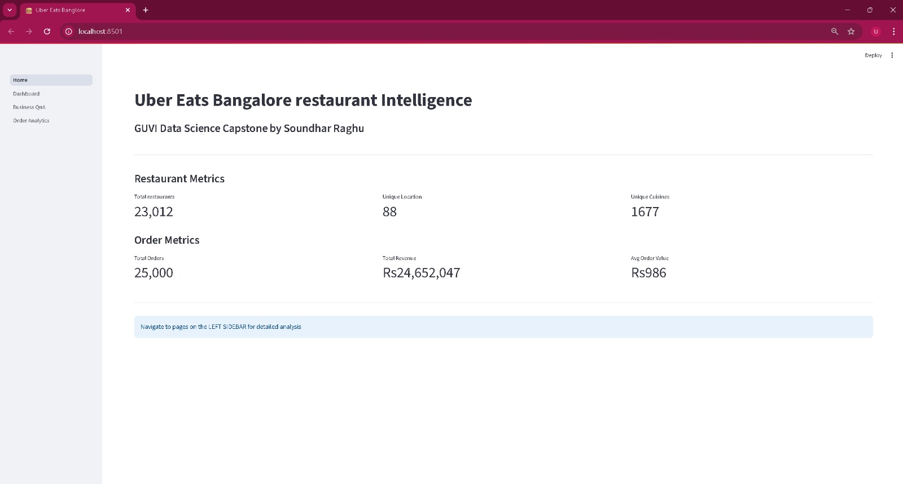
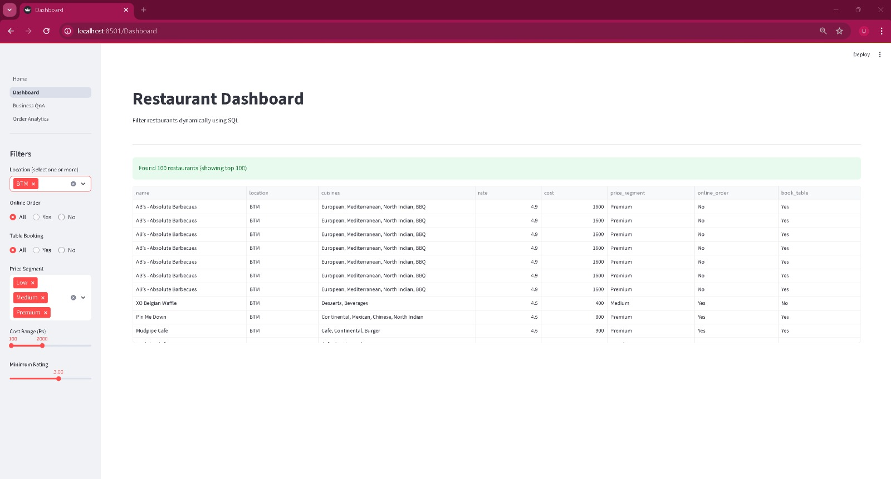
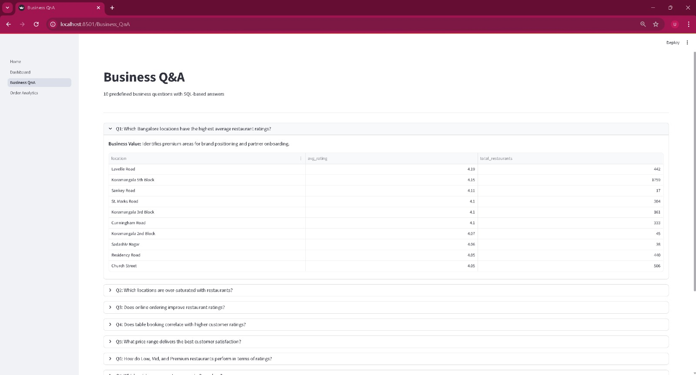
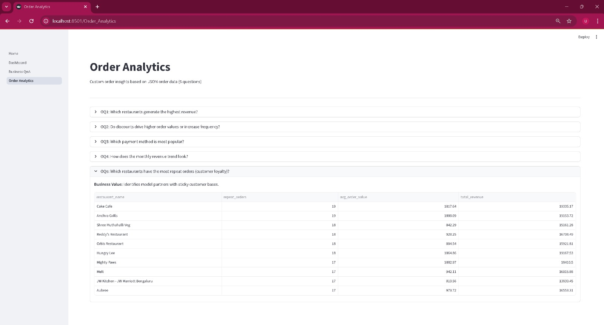

# Uber Eats Bangalore Restaurant Intelligence

**GUVI Data Science Capstone** by Soundhar Raghu

A Streamlit web application analyzing Uber Eats Bangalore restaurant and order data using pure SQL queries. Built as my GUVI capstone project.

---

## Business Objective

Enable Uber Eats to make data-driven decisions on:
- **Partner acquisition** — identify high-rated locations
- **Market expansion** — avoid over-saturated areas
- **Pricing strategy** — validate segment performance
- **Feature ROI** — measure online ordering and table booking impact
- **Revenue optimization** — analyze discount and payment patterns

---

## Tech Stack

- **Python** 3.13
- **Pandas** — data cleaning and transformation
- **SQLite** — relational database with 2 tables
- **Streamlit** — interactive web dashboard (4 pages)
- **SQL** — pure query-based analytics (15 queries total)
- **Git + GitHub** — version control

---

## Project Structure

guvi-eats/
- data/
  - raw/ — Original CSV and JSON files
  - clean/ — Cleaned data (post-processing)
- notebooks/
  - 01_explore.ipynb — CSV exploration and cleaning
  - 02_clean_json.ipynb — JSON exploration and cleaning
  - 03_load_to_sql.ipynb — SQLite loading and query testing
- database/
  - ubereats.db — SQLite database (2 tables)
- sql/
  - queries.sql — All 15 SQL queries
- app/
  - Home.py — KPI dashboard (entry point)
  - pages/
    - 1_Dashboard.py — Dynamic filter dashboard
    - 2_Business_QnA.py — 10 restaurant business questions
    - 3_Order_Analytics.py — 5 custom order questions
- requirements.txt — Python dependencies
- .gitignore — Files to exclude
- README.md — This file

---

## Data Pipeline

**Raw Data:**
- Restaurants CSV: 23,193 rows cleaned to 22,993 (200 dropped)
- Orders JSON: 25,000 records

**Cleaning Steps:**
- Rating normalization (removed /5, converted NEW to null)
- Cost standardization (removed commas, converted to numeric)
- Missing value handling
- Duplicate removal
- Feature engineering: price_segment (Low/Medium/Premium), rating_category (Excellent/Good/Poor)
- Date extraction: year, month, month_name from order_date

**Storage:** All cleaned data loaded into SQLite as 2 tables (restaurants, orders)

---

## Application Pages

### 1. Home
- 6 KPI metrics: total restaurants, locations, cuisines, orders, revenue, avg order value

### 2. Dashboard
- 6 sidebar filters: location, online order, table booking, price segment, cost range, minimum rating
- Dynamic SQL query building based on filter selections
- Real-time filtered results in table format

### 3. Business Q&A
- 10 predefined business questions
- SQL-driven answers displayed as tables in expandable sections
- Covers location analysis, feature ROI, cuisine trends, pricing insights

### 4. Order Analytics
- 5 custom-designed order questions
- Revenue analysis, discount impact, payment preferences, monthly trends, customer loyalty

---

## Key Business Insights Discovered

- **Lavelle Road** (4.19 stars) and **Koramangala 5th Block** (4.15 stars) are premium areas for onboarding
- **Table booking increases ratings by 0.35 stars** (4.16 vs 3.81) — strong feature push opportunity
- **Premium segment wins ratings** (4.07 stars) despite highest cost — customers pay for quality
- **Discounts drive 40% higher order values** (Rs 1,150 vs Rs 822) — not order frequency
- **Payment methods are balanced** (Card/Cash/UPI each around 33% share)
- **No Bangalore area has quality crisis** — all high-demand locations maintain more than 3.5 ratings

---

## How to Run Locally

Clone the repository:

git clone https://github.com/YOUR-USERNAME/guvi-eats.git
cd guvi-eats

Install dependencies:

pip install -r requirements.txt

Run the Streamlit app:

cd app
streamlit run Home.py

The application opens automatically at http://localhost:8501

---

## Screenshots

### Home Page

### Dashboard with Dynamic Filters

### Business Q&A

### Order Analytics

---

## Author

**Raghu Soundhar**
GUVI Data Science Course 2026

Currently a Business Analyst at HPE Solution Operations, transitioning to Machine Learning Engineering.

---

## Acknowledgments

- **GUVI** for the structured Data Science curriculum
- **Uber Eats / Zomato Bangalore dataset** as the foundation for analysis